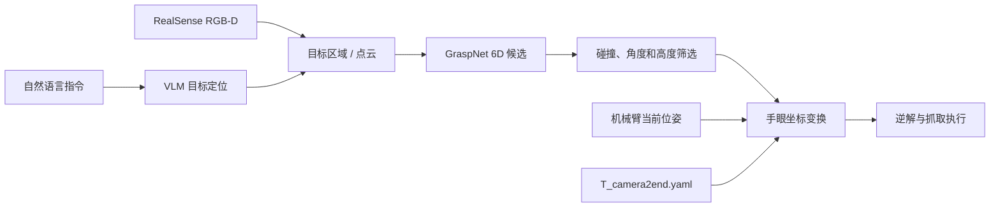

# 语言引导的 6D 视觉抓取系统

[English](README_EN.md)

这是一个面向自制机械臂的研究型 6D 抓取项目。系统使用 Intel RealSense 获取 RGB-D 数据，通过 GraspNet 生成六自由度抓取候选，并结合手眼标定结果，将相机坐标系中的抓取位姿转换到机械臂基坐标系。项目还提供了基于视觉语言模型（VLM）的自然语言目标选择流程。

> 当前状态：研究原型。机械臂会真实运动，运行前请完整阅读“安全须知”和“已知限制”。

## 功能

- RealSense RGB-D 图像与点云采集
- 眼在手外（eye-to-hand）手眼标定
- GraspNet 6D 抓取姿态预测
- 碰撞、抓取角度和高度筛选
- 相机坐标系到机械臂基坐标系的位姿转换
- Open3D 可视化及键盘交互执行
- 通过自然语言指定抓取目标
- 支持 DashScope API，也保留本地 Grounding DINO 检测接口

## 系统流程



## 项目结构

```text
6d_grasp/
├── requirements-episode-env.txt
├── requirements-episode-env-pytorch-cu118.txt
└── 代码/
    ├── 6d/
    │   ├── 0.teach_mode.py
    │   ├── 1.1.generate_points.py
    │   ├── 2.2.generate_images_and_T.py
    │   ├── 3.calibrate.py
    │   ├── 4.test_gripper.py
    │   ├── config.yaml
    │   └── T_camera2end.yaml
    └── graspnet-baseline/
        ├── 1.verify_grasp.py
        ├── 2.demo_VLM_grasp.py
        ├── 3.demo_VLM_handler.py
        ├── checkpoint-rs.tar
        ├── T_camera2end.yaml
        ├── pointnet2/
        ├── knn/
        ├── graspnetAPI/
        └── VLM_related/
```

带有旧版本号的 `1.generate_points.py` 和 `2.generate_images_and_T.py` 仍保留在项目中；以下说明使用更新的 `1.1` 与 `2.2` 脚本。

## 硬件与软件要求

推荐硬件：

- 带夹爪的 Episode 自制机械臂
- Intel RealSense D435 或兼容 RGB-D 相机
- NVIDIA GPU（GraspNet 推理及自定义 CUDA 算子需要）
- 用于手眼标定的棋盘格
- Linux 系统，建议 Ubuntu 20.04/22.04

本项目现有环境文件对应 Python 3.8、PyTorch 2.0.1 和 CUDA 11.8。其他 CUDA/PyTorch 组合可能可用，但需要重新编译 `pointnet2` 和 `knn` 扩展。

## 安装

以下命令均从项目根目录执行。

```bash
conda create -n graspnet_env python=3.8 -y
conda activate graspnet_env

pip install -r requirements-episode-env-pytorch-cu118.txt
pip install -r requirements-episode-env.txt
pip install open3d tensorboard
```

编译 GraspNet 所需扩展并安装 API：

```bash
cd 代码/graspnet-baseline/pointnet2
python setup.py install

cd ../knn
python setup.py install

cd ../graspnetAPI
pip install -e .
```

如需更换 CUDA 版本，请先安装匹配的 PyTorch，再重新编译上述扩展。可以使用以下命令检查环境：

```bash
python -c "import torch; print(torch.__version__, torch.version.cuda, torch.cuda.is_available())"
python -c "import pyrealsense2, open3d; print('RealSense/Open3D OK')"
```

## 模型文件

GraspNet 权重应放在：

```text
代码/graspnet-baseline/checkpoint-rs.tar
```

请从 [GraspNet Baseline 官方仓库](https://github.com/graspnet/graspnet-baseline)提供的链接获取权重，并确认文件完整。大型权重不建议直接提交到普通 Git 历史中，可使用 Git LFS、GitHub Release 或在 README 中提供下载地址。

如果使用本地 Grounding DINO，将 `IDEA-Research/grounding-dino-base` 模型放在：

```text
代码/graspnet-baseline/VLM_related/grounding-dino-base/
```

模型主页：[IDEA-Research/grounding-dino-base](https://huggingface.co/IDEA-Research/grounding-dino-base)。默认 VLM 流程使用 DashScope API，本地 Grounding DINO 是可选方案。

## 机械臂服务

仓库中的 `episodeApp.py` 是 TCP 客户端，默认连接：

```text
localhost:12345
```

运行标定或抓取脚本前，必须先启动机械臂厂商提供的 Episode 控制服务。该服务端程序不包含在本仓库中。如果服务运行在另一台电脑，请修改脚本中的 IP 地址，并确认端口和防火墙设置。

## 手眼标定

当前 `代码/6d/config.yaml` 默认使用：

- 相机分辨率：1280 × 720，30 FPS
- 棋盘格内角点：11 × 8
- 方格边长：13.6 mm
- 初始位置：`[260, 0, 300]` mm
- 初始姿态：`[180, 0, 90]` 度

这些参数必须与实际棋盘格和机械臂匹配。

进入标定目录：

```bash
cd 代码/6d
```

先将机械臂移动到标定准备姿态：

```bash
python 1.1.generate_points.py prepare
```

再进入自由示教并采样稳定姿态：

```bash
python 1.1.generate_points.py generate
```

采集每个姿态对应的图像与末端位姿：

```bash
python 2.2.generate_images_and_T.py
```

最后计算手眼变换：

```bash
python 3.calibrate.py
```

脚本会让你选择 Horaud、Tsai 或 Park 方法，并输出 `T_camera2end.yaml`。检查标定结果后，将它复制到抓取程序目录：

```bash
cp T_camera2end.yaml ../graspnet-baseline/T_camera2end.yaml
```

`T_camera2end.yaml` 与具体机械臂、相机安装位置一一对应。相机、底座或末端发生移动后必须重新标定，不要直接使用仓库中的示例矩阵。

可选：`0.teach_mode.py` 可以记录和复现示教轨迹：

```bash
python 0.teach_mode.py prepare
python 0.teach_mode.py replicate
```

## 夹爪测试

正式抓取前可单独检查夹爪通信与动作：

```bash
cd 代码/6d
python 4.test_gripper.py
```

测试时不要把手放在夹爪运动范围内。

## 运行 GraspNet 抓取

```bash
cd 代码/graspnet-baseline
python 1.verify_grasp.py --checkpoint_path ./checkpoint-rs.tar
```

常用参数：

```bash
python 1.verify_grasp.py \
  --checkpoint_path ./checkpoint-rs.tar \
  --num_point 20000 \
  --num_view 300 \
  --collision_thresh 0.01 \
  --voxel_size 0.01
```

Open3D 窗口快捷键：

| 按键 | 功能 |
| --- | --- |
| `W` / `S` | 增加 / 减少额外抓取高度 |
| `A` / `D` | 增加 / 减少额外旋转角度 |
| `I` / `U` | 调整最大抓取角度阈值 |
| `O` / `P` | 调整最小高度阈值 |
| `J` / `K` | 打开 / 关闭夹爪 |
| `M` | 执行当前筛选后的第一个抓取候选 |
| `Q` | 关闭窗口 |

按下 `M` 会让机械臂真实运动。请先核对点云、抓取框、坐标变换及运动范围。

## 运行语言引导抓取

默认实现通过 DashScope 调用文本模型和视觉语言模型。请使用环境变量配置密钥，不要把密钥写入代码或提交到 GitHub：

```bash
export DASHSCOPE_API_KEY="your_api_key"
export DASHSCOPE_LLM_MODEL="qwen-plus"
export DASHSCOPE_VLM_MODEL="qwen3-vl-plus"
```

在第一个终端启动自然语言与目标定位界面：

```bash
cd 代码/graspnet-baseline
python 2.demo_VLM_grasp.py
```

在第二个终端启动 GraspNet 处理和机械臂执行程序：

```bash
cd 代码/graspnet-baseline
python 3.demo_VLM_handler.py --checkpoint_path ./checkpoint-rs.tar
```

两个进程通过 `VLM_related/exchange/` 中的文件交换 RGB-D、相机参数和目标框，因此必须从 `代码/graspnet-baseline` 目录运行。目标框与抓取结果需要人工确认；网络模型输出不能作为机械臂安全保证。

## 常见问题

### 无法连接机械臂

确认 Episode 服务已启动，并检查 `localhost:12345` 是否可访问：

```bash
ss -lntp | grep 12345
```

如果控制服务不在本机，请使用实际 IP，并放行相应端口。

### RealSense 无法打开

检查 USB 连接和设备权限：

```bash
rs-enumerate-devices
```

关闭其他占用相机的程序，并尽量使用 USB 3.x 接口。

### CUDA 扩展导入失败

确认 PyTorch CUDA 版本与本机驱动兼容，然后在当前环境中重新安装 `pointnet2` 和 `knn`。旧环境编译出的 `.so` 文件不能保证可在新环境中使用。

### 抓取位置整体偏移

优先检查棋盘格尺寸、标定图像质量、坐标系方向和 `T_camera2end.yaml`。如果相机安装位置改变，应重新执行完整手眼标定。

## 安全须知

- 首次运行应使用低速，并保持急停可用。
- 清空机械臂工作空间，避免人员进入运动范围。
- 每次执行前检查相机画面、深度点云和 6D 抓取框。
- 标定不可靠、深度图异常或网络模型定位错误时，不要执行运动。
- 不要在无人看管的情况下运行机械臂。
- 本项目不是具备功能安全认证的工业控制系统。

## 已知限制

- 部分路径按当前工作目录解析，建议严格从文档指定目录启动脚本。
- 相机参数在部分脚本中固定为 1280 × 720、30 FPS。
- Episode 控制服务端不包含在本仓库中。
- VLM API 依赖网络，返回的目标框可能不准确。
- 标定矩阵、机械臂初始位姿和阈值均需要针对实际设备调整。
- 当前项目未提供量化成功率或标准化测试结果。


## 致谢与引用

本项目基于 [GraspNet Baseline](https://github.com/graspnet/graspnet-baseline)、[GraspNetAPI](https://github.com/graspnet/graspnetAPI)、[GraspNet-1Billion](https://graspnet.net/) 和 [Grounding DINO](https://github.com/IDEA-Research/GroundingDINO) 等开源工作。

如果该项目对你的研究有帮助，请引用 GraspNet-1Billion：

```bibtex
@inproceedings{fang2020graspnet,
  title={GraspNet-1Billion: A Large-Scale Benchmark for General Object Grasping},
  author={Fang, Hao-Shu and Wang, Chenxi and Gou, Minghao and Lu, Cewu},
  booktitle={Proceedings of the IEEE/CVF Conference on Computer Vision and Pattern Recognition},
  year={2020}
}
```

## 许可证

仓库中的 GraspNet 相关代码及第三方组件受其各自许可证约束，其中 GraspNet Baseline 的许可包含非商业用途限制。
