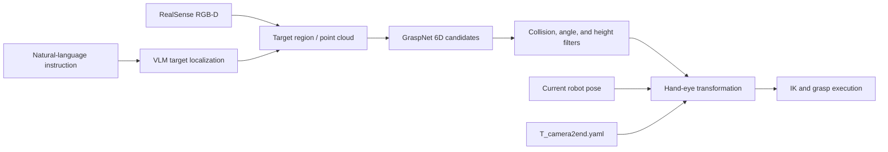

# Language-Guided 6D Robotic Grasping

[中文](README.md)

This is a research-oriented 6D grasping project for a custom robotic arm. It captures RGB-D data with an Intel RealSense camera, generates six-degree-of-freedom grasp candidates with GraspNet, and transforms camera-frame grasps into the robot base frame using hand-eye calibration. It also provides a vision-language-model (VLM) workflow for selecting target objects with natural-language instructions.

> Status: research prototype. The software commands a physical robot. Read the Safety section and Known Limitations before running it.

## Features

- RealSense RGB-D and point-cloud acquisition
- Eye-to-hand calibration
- GraspNet 6D grasp-pose prediction
- Collision, orientation, and height filtering
- Camera-to-robot-base pose transformation
- Open3D visualization and keyboard-controlled execution
- Natural-language target selection
- DashScope API workflow with an optional local Grounding DINO detector

## Pipeline



## Repository Layout

```text
6d_grasp/
├── requirements-episode-env.txt
├── requirements-episode-env-pytorch-cu118.txt
└── 代码/
    ├── 6d/
    │   ├── 0.teach_mode.py
    │   ├── 1.1.generate_points.py
    │   ├── 2.2.generate_images_and_T.py
    │   ├── 3.calibrate.py
    │   ├── 4.test_gripper.py
    │   ├── config.yaml
    │   └── T_camera2end.yaml
    └── graspnet-baseline/
        ├── 1.verify_grasp.py
        ├── 2.demo_VLM_grasp.py
        ├── 3.demo_VLM_handler.py
        ├── checkpoint-rs.tar
        ├── T_camera2end.yaml
        ├── pointnet2/
        ├── knn/
        ├── graspnetAPI/
        └── VLM_related/
```

Older `1.generate_points.py` and `2.generate_images_and_T.py` files are retained in the repository. This guide uses the newer `1.1` and `2.2` scripts.

## Hardware and Software Requirements

Recommended hardware:

- Custom Episode robotic arm with a gripper
- Intel RealSense D435 or a compatible RGB-D camera
- NVIDIA GPU for GraspNet inference and custom CUDA extensions
- Checkerboard target for hand-eye calibration
- Linux, preferably Ubuntu 20.04 or 22.04

The supplied environment files target Python 3.8, PyTorch 2.0.1, and CUDA 11.8. Other PyTorch/CUDA combinations may work, but the `pointnet2` and `knn` extensions must be rebuilt.

## Installation

Run these commands from the repository root:

```bash
conda create -n graspnet_env python=3.8 -y
conda activate graspnet_env

pip install -r requirements-episode-env-pytorch-cu118.txt
pip install -r requirements-episode-env.txt
pip install open3d tensorboard
```

Build the GraspNet extensions and install its API:

```bash
cd 代码/graspnet-baseline/pointnet2
python setup.py install

cd ../knn
python setup.py install

cd ../graspnetAPI
pip install -e .
```

If you change CUDA versions, install the matching PyTorch build first and rebuild both extensions. Verify the environment with:

```bash
python -c "import torch; print(torch.__version__, torch.version.cuda, torch.cuda.is_available())"
python -c "import pyrealsense2, open3d; print('RealSense/Open3D OK')"
```

## Model Files

Place the GraspNet checkpoint at:

```text
代码/graspnet-baseline/checkpoint-rs.tar
```

Obtain the checkpoint from the links in the [official GraspNet Baseline repository](https://github.com/graspnet/graspnet-baseline) and verify the downloaded file. 

For optional local Grounding DINO inference, place `IDEA-Research/grounding-dino-base` at:

```text
代码/graspnet-baseline/VLM_related/grounding-dino-base/
```

Model page: [IDEA-Research/grounding-dino-base](https://huggingface.co/IDEA-Research/grounding-dino-base). The default VLM workflow uses the DashScope API; local Grounding DINO is optional.

## Robot Control Service

The included `episodeApp.py` is a TCP client. By default, it connects to:

```text
localhost:12345
```

Before running calibration or grasping, start the Episode control service supplied by the robot vendor. The server implementation is not included in this repository. If it runs on another computer, update the IP address in the scripts and check the port and firewall configuration.

## Hand-Eye Calibration

The current `代码/6d/config.yaml` defaults to:

- Camera stream: 1280 × 720 at 30 FPS
- Checkerboard inner corners: 11 × 8
- Square size: 13.6 mm
- Initial position: `[260, 0, 300]` mm
- Initial orientation: `[180, 0, 90]` degrees

These settings must match the physical checkerboard and robot.

Enter the calibration directory:

```bash
cd 代码/6d
```

Move the robot to the calibration preparation pose:

```bash
python 1.1.generate_points.py prepare
```

Enter free-teach mode and sample stable poses:

```bash
python 1.1.generate_points.py generate
```

Capture the image and end-effector pose associated with each sample:

```bash
python 2.2.generate_images_and_T.py
```

Compute the hand-eye transform:

```bash
python 3.calibrate.py
```

The script prompts for the Horaud, Tsai, or Park method and writes `T_camera2end.yaml`. After validating the result, copy it to the grasping directory:

```bash
cp T_camera2end.yaml ../graspnet-baseline/T_camera2end.yaml
```

`T_camera2end.yaml` is specific to one robot and camera mounting configuration. Recalibrate whenever the camera, robot base, or end-effector mounting changes. Do not blindly reuse the example transform committed to the repository.

Optional: record and replay a teach-mode trajectory with:

```bash
python 0.teach_mode.py prepare
python 0.teach_mode.py replicate
```

## Gripper Test

Test gripper communication and motion before grasping:

```bash
cd 代码/6d
python 4.test_gripper.py
```

Keep hands and other objects out of the gripper's travel range.

## Run GraspNet Grasping

```bash
cd 代码/graspnet-baseline
python 1.verify_grasp.py --checkpoint_path ./checkpoint-rs.tar
```

Common arguments:

```bash
python 1.verify_grasp.py \
  --checkpoint_path ./checkpoint-rs.tar \
  --num_point 20000 \
  --num_view 300 \
  --collision_thresh 0.01 \
  --voxel_size 0.01
```

Open3D keyboard controls:

| Key | Action |
| --- | --- |
| `W` / `S` | Increase / decrease the extra grasp height |
| `A` / `D` | Increase / decrease the extra rotation angle |
| `I` / `U` | Adjust the maximum grasp-angle threshold |
| `O` / `P` | Adjust the minimum height threshold |
| `J` / `K` | Open / close the gripper |
| `M` | Execute the first remaining grasp candidate |
| `Q` | Close the viewer |

Pressing `M` causes real robot motion. Verify the point cloud, grasp frame, coordinate transform, and workspace before execution.

## Run Language-Guided Grasping

The default implementation uses DashScope text and vision-language models. Configure credentials through environment variables; never hard-code or commit API keys:

```bash
export DASHSCOPE_API_KEY="your_api_key"
export DASHSCOPE_LLM_MODEL="qwen-plus"
export DASHSCOPE_VLM_MODEL="qwen3-vl-plus"
```

Start the language and target-localization interface in the first terminal:

```bash
cd 代码/graspnet-baseline
python 2.demo_VLM_grasp.py
```

Start GraspNet processing and robot execution in a second terminal:

```bash
cd 代码/graspnet-baseline
python 3.demo_VLM_handler.py --checkpoint_path ./checkpoint-rs.tar
```

The two processes exchange RGB-D data, camera parameters, and target boxes through files in `VLM_related/exchange/`. Run both from `代码/graspnet-baseline` so the relative paths resolve correctly. A human must verify target boxes and grasp results; model output is not a robot-safety guarantee.

## Troubleshooting

### Robot connection fails

Confirm that the Episode service is running and that `localhost:12345` is reachable:

```bash
ss -lntp | grep 12345
```

If the service is remote, use its actual IP address and allow the port through the firewall.

### RealSense cannot be opened

Check the USB connection and device permissions:

```bash
rs-enumerate-devices
```

Close applications that may already be using the camera, and prefer a USB 3.x port.

### CUDA extension import errors

Confirm that the PyTorch CUDA build is compatible with the installed NVIDIA driver, then reinstall `pointnet2` and `knn` in the active environment. A `.so` built in another environment is not guaranteed to work.

### Grasp positions have a consistent offset

Check the checkerboard dimensions, calibration-image quality, coordinate-frame conventions, and `T_camera2end.yaml`. Repeat the entire hand-eye calibration after any camera movement.

## Safety

- Use a low speed for first runs and keep an emergency stop available.
- Clear the robot workspace and keep people outside its motion range.
- Inspect the camera image, depth point cloud, and 6D grasp frame before every execution.
- Do not command motion when calibration is unreliable, depth is invalid, or VLM localization is incorrect.
- Never operate the robot unattended.
- This project is not a functionally certified industrial safety system.

## Known Limitations

- Several paths are resolved relative to the current working directory; launch scripts from the directories documented above.
- Some scripts fix the camera stream at 1280 × 720 and 30 FPS.
- The Episode robot-control server is not included.
- The VLM API requires network access and may return inaccurate target boxes.
- Calibration transforms, initial poses, and thresholds must be tuned for the physical setup.
- No standardized success-rate benchmark is provided for the current prototype.

## Acknowledgements and Citation

This project builds on [GraspNet Baseline](https://github.com/graspnet/graspnet-baseline), [GraspNetAPI](https://github.com/graspnet/graspnetAPI), [GraspNet-1Billion](https://graspnet.net/), and [Grounding DINO](https://github.com/IDEA-Research/GroundingDINO).

If this project supports your research, please cite GraspNet-1Billion:

```bibtex
@inproceedings{fang2020graspnet,
  title={GraspNet-1Billion: A Large-Scale Benchmark for General Object Grasping},
  author={Fang, Hao-Shu and Wang, Chenxi and Gou, Minghao and Lu, Cewu},
  booktitle={Proceedings of the IEEE/CVF Conference on Computer Vision and Pattern Recognition},
  year={2020}
}
```

## License

GraspNet-derived code and other third-party components remain subject to their respective licenses. The GraspNet Baseline license includes a non-commercial-use restriction. 
